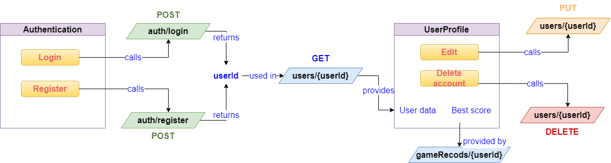

# Game on web of data - Api usage guide
## Link to the swagger documentation: https://app.swaggerhub.com/apis-docs/NeverLess/GADA/1.0.0

### How the API is going to be used in our web app
#### Authentication and User Profile pages

#### Homepage
A) If the user has no game in progress  

B) If the user has a game in progress  

#### Game play
The progression of the game will be realised by repeating the following steps:
1) the scene is created using the info extracted from gameState object
2) the user select an option
3) a call to the games' endpoint is made, and we receive a new gameState
  
For the creation of the scene it will need info about the characters participating in the action, info that will be provided by the **characters** endpoint

#### Finishing a game
When a game is over, for space-saving and performance purposes it will trigger the following actions:
1) creating a record in the gamesRecords table contain just the score and the user id, calling **gameRecords** endpoint with POST method
2) deleting the game record from the table with games in progress, calling **games/{userId}** endpoint with DELETE method
